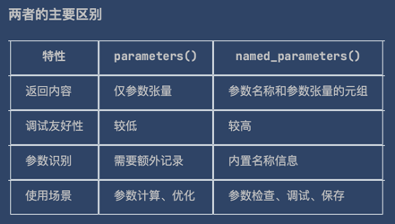
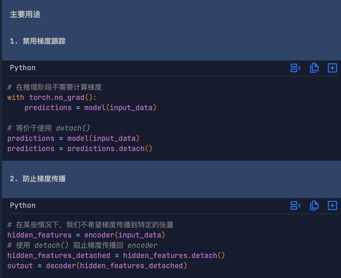

#### ReLU 激活函数
- 全称：Rectified Linear Unit（修正线性单元）
- 功能：对输入数据进行非线性变换
- 数学表达式：f(x) = max(0, x)
- 作用：
  - 将所有负值置为 0
  - 正值保持不变
##### 在神经网络中的作用
1. 引入非线性：使神经网络能够学习和表示复杂的非线性关系
2. 缓解梯度消失：相比 sigmoid 或 tanh 函数，ReLU 在正区间梯度恒为 1，有助于梯度传播
3. 计算简单：只涉及阈值操作，计算效率高
##### 实际效果示例
当 ReLU 应用到张量时，它会将所有负值置为 0，正值保持不变：
```python
# 假设 hidden1 是一个包含正负值的张量
Before ReLU: tensor([[-0.5,  2.1, -1.2,  3.0],
                     [ 1.8, -0.3,  0.7, -2.5]])

# 应用 ReLU 后
After ReLU: tensor([[0.0, 2.1, 0.0, 3.0],
                    [1.8, 0.0, 0.7, 0.0]])
```
-------------------------

#### nn.Linear
> nn.Linear是PyTorch中实现线性变换（全连接层）的核心模块。
1. 基本概念
nn.Linear表示一个线性变换层，对输入执行以下操作：
```html
y = xA^T + b
其中：
x是输入张量
A是权重矩阵
b是偏置向量
y是输出张量
```
```python
nn.Linear(in_features, out_features, bias=True)
```
- in_features: 输入特征的数量（输入维度）
- out_features: 输出特征的数量（输出维度）
- bias: 是否包含偏置项（默认为True）
##### 工作原理示例
```python
# 创建一个线性层
layer1 = nn.Linear(in_features=28*28, out_features=20)
hidden1 = layer1(flat_image)
print(hidden1.size())  # 输出: torch.Size([3, 20])
```
在这个例子中：
- 输入：形状为(3, 784)的张量（3个样本，每个样本784个特征）
权重矩阵A：形状为(20, 784)
偏置向量b：形状为(20,)
输出：形状为(3, 20)的张量（3个样本，每个样本20个特征）
##### 权重和偏置
每个nn.Linear层都有可学习的参数：
weight: 权重矩阵，形状为(out_features, in_features)
bias: 偏置向量，形状为(out_features)
```python
# 查看线性层的参数
layer = nn.Linear(784, 512)
print(layer.weight.shape)  # torch.Size([512, 784])
print(layer.bias.shape)    # torch.Size([512])

```
##### 特点
- 可学习参数：权重和偏置在训练过程中会被优化
- 全连接：输入的每个神经元都连接到输出的每个神经元
- 线性变换：执行线性映射，通常与激活函数（如ReLU）配合使用以引入非线性
##### 在神经网络中的作用
nn.Linear层在你的神经网络中承担着特征变换和分类的关键作用：
- 逐步将高维输入数据映射到低维特征空间
- 最终将特征映射到类别空间，用于分类任务
- 与ReLU激活函数结合，构建深度神经网络的表达能力

-------------------------

#### self.flatten = nn.Flatten()

这行代码创建了一个**展平层**，用于处理图像数据：
- 输入：通常是形状为 (batch_size, channels, height, width) 的图像张量
例如 MNIST 数据：(batch_size, 1, 28, 28)
- 输出：展平后的二维张量 (batch_size, features)
例如：(batch_size, 784)，其中 784 = 1×28×28
- 使用场景
在神经网络中，通常需要将图像数据从多维格式（如 28×28 像素）转换为一维向量，以便输入到全连接层（nn.Linear）中。
nn.Flatten() 层正好完成这个转换任务。
示例  
假设输入是一个批次的 MNIST 图像，形状为 (32, 1, 28, 28)（32张图片）：
经过 self.flatten 后变为 (32, 784)
这样就可以作为输入传递给第一个线性层 nn.Linear(28*28, 512)
这是图像分类任务中常见的预处理步骤。

#### 全连接层（Fully Connected Layer）是神经网络中的基本组成部分，也称为线性层或密集层。
基本概念
- 定义：全连接层中的每个神经元都与前一层的所有神经元相连接
- 别名：在 PyTorch 中通常用 nn.Linear 表示
- 功能：执行线性变换，将输入数据映射到输出空间
- 工作原理
数学表达式：y = Wx + b
W：权重矩阵
x：输入向量
b：偏置向量
y：输出向量
- 连接方式：
输入层的每个节点都连接到输出层的每个节点
每个连接都有一个可学习的权重参数
- 例子
```python
import os
import torch
from torch import nn
nn.Linear(28*28, 512)  # 将784维输入映射到512维输出
nn.Linear(512, 512)    # 保持512维不变
nn.Linear(512, 10)     # 将512维映射到10维输出（分类结果）
```

-------------------------

#### Softmax 函数
- 函数定义：Softmax(x) = exp(x) / sum(exp(x))
##### Softmax函数的主要作用是：
- 将任意实数向量转换为**概率分布**
- 输出向量中每个元素都在[0,1]区间内
- 所有元素之和等于1
```python
# 模型输出原始logits
logits = model(X)

# 转换为概率分布
pred_probab = nn.Softmax(dim=1)(logits)

# 选择概率最高的类别
y_pred = pred_probab.argmax(1)
```
##### 参数解释
dim=1参数的含义：
指定在哪个维度上应用Softmax
在你的例子中，dim=1表示在类别维度上应用Softmax
假设输出形状为(batch_size, num_classes)，则对每个样本的10个类别应用Softmax
##### 为什么使用Softmax
- 概率解释性：输出可以解释为每个类别的概率
- 多分类适用：特别适合多分类问题（你的网络有10个输出类别）
- 梯度友好：在反向传播中具有良好的梯度特性
- 标准化：确保输出总和为1，便于比较和决策

-------------------------

#### PyTorch中的dim参数详解
在PyTorch中，dim参数指定张量的某个维度（轴），用于确定在哪个维度上执行操作。
1. 张量维度基础概念
对于一个张量，每个维度都有一个索引：
  - dim=0：第一个维度（通常是batch维度）
  - dim=1：第二个维度（通常是==***特征/类别维度***）
  - dim=2：第三个维度（通常是高度维度）
以此类推...
2. 实际例子说明
假设你的模型输出logits形状为 (32, 10)：
 - 第一维度（dim=0）：batch size = 32（表示32个样本）
 - 第二维度（dim=1）：classes = 10（表示10个类别）
当你使用 nn.Softmax(dim=1) 时：
 对每个样本（共32个）独立计算Softmax,在10个类别上应用Softmax，使得每个样本的10个输出值之和为1.

-------------

### nn.Sequential
nn.Sequential是 PyTorch 中的一个模块容器，它允许你按顺序组织多个神经网络层。 它可以将多个网络层组合成一个网络。
#### 主要特点
- 顺序执行：数据按照添加到容器中的顺序依次通过每个模块
- 简化代码：避免手动编写前向传播函数（forward）
- 易于管理：可以将多个层组合成一个整体进行管理
```python
self.linear_relu_stack = nn.Sequential(
    nn.Linear(28*28, 512),  # 线性层：将784维输入映射到512维
    nn.ReLU(),              # 激活函数
    nn.Linear(512, 512),    # 线性层：512维到512维
    nn.ReLU(),              # 激活函数
    nn.Linear(512, 10),     # 线性层：512维到10维（输出层）
)
#等价于：
# 等价的手动实现
def forward(self, x):
    x = self.flatten(x)
    x = self.linear1(x)
    x = nn.ReLU()(x)
    x = self.linear2(x)
    x = nn.ReLU()(x)
    x = self.linear3(x)
    return x

```
#### 优势
- 代码简洁：减少了重复代码
- 可读性强：网络结构一目了然
- 易于修改：添加或删除层非常方便
#### 使用场景
- 快速构建简单的前馈神经网络
- 将网络的某一部分组织成模块
- 构建具有重复结构的网络组件
总之，nn.Sequential 是 PyTorch 中构建神经网络的一种便捷方式，特别适用于层与层之间是简单顺序连接的网络结构。

---------------


### nn.Softmax
> nn.Softmax 是 PyTorch 中的一个激活函数模块，主要用于将原始的神经网络输出（logits）转换为概率分布。

#### 基本定义
nn.Softmax 将任意实数向量转换为概率分布，确保输出值在 [0,1] 区间内，且所有元素之和等于 1。
####  数学表达式：
Softmax(x_i) = exp(x_i) / Σ(exp(x_j)) for all j
#### 主要作用
- 概率转换：将神经网络的原始输出转换为概率分布
- 多分类适用：特别适用于多分类问题
- 标准化输出：确保所有输出值之和为 1
```python
# 模型输出原始logits
logits = model(X)

# 转换为概率分布
pred_probab = nn.Softmax(dim=1)(logits)

# 选择概率最高的类别
y_pred = pred_probab.argmax(1)

```
#### 与其它激活函数的区别
Softmax：用于多分类输出层，输出为**概率分布**
Sigmoid：用于二分类或多标签分类，每个输出独立
ReLU：用于隐藏层，引入非线性
nn.Softmax 是多分类神经网络中不可或缺的组件，它将模型的原始输出转换为可解释的概率，便于进行分类决策。
----------
### parameters()方法
#### 特点
1. 返回类型：迭代器(Iterator)
2. 包含内容：模型中所有需要学习的参数张量
3. 顺序：按照参数在模型中定义的顺序返回
```python

# 获取模型中的所有参数
for param in model.parameters():
    print(param.shape)
    
# 计算模型参数总数
total_params = sum(p.numel() for p in model.parameters())
print(f"Total parameters: {total_params}")

# 将参数移到指定设备
for param in model.parameters():
    param.requires_grad = True  # 设置是否需要梯度计算

```
### named_parameters() 方法
#### 功能
> named_parameters()方法返回模型中所有可学习参数及其名称的迭代器，提供了参数的可读标识。
#### 特点
1. 返回类型：迭代器，每个元素是(name, parameter)的元组
2. 包含内容：参数名称字符串和对应的参数张量
3. 命名规则：基于层的名称和参数类型自动命名
```python
# 获取参数名称和对应的参数值
for name, param in model.named_parameters():
    print(f"Layer: {name} | Shape: {param.shape} | Requires Grad: {param.requires_grad}")

# 输出示例：
# Layer: flatten.weight | Shape: torch.Size([784, 784]) | Requires Grad: True
# Layer: linear_relu_stack.0.weight | Shape: torch.Size([512, 784]) | Requires Grad: True
# Layer: linear_relu_stack.0.bias | Shape: torch.Size([512]) | Requires Grad: True
# Layer: linear_relu_stack.2.weight | Shape: torch.Size([512, 512]) | Requires Grad: True
# Layer: linear_relu_stack.2.bias | Shape: torch.Size([512]) | Requires Grad: True
# Layer: linear_relu_stack.4.weight | Shape: torch.Size([10, 512]) | Requires Grad: True
# Layer: linear_relu_stack.4.bias | Shape: torch.Size([10]) | Requires Grad: True

```



## torch.matmul 详解

torch.matmul 是 PyTorch 中用于执行矩阵乘法的核心函数，它支持多种张量维度的乘法运算。
基本概念
torch.matmul(input, other, out=None) 执行输入张量 input 和 other 的矩阵乘法，其行为根据输入张量的维度而有所不同。
#### 在神经网络中的应用
```python
import torch

x = torch.ones(5)  # shape: [5]
w = torch.randn(5, 3, requires_grad=True)  # shape: [5, 3]
z = torch.matmul(x, w) + b  # 矩阵乘法: [5] × [5, 3] = [3]
```
在这个例子中：
x 是一个一维张量 (5个元素)
w 是一个二维张量 (5×3矩阵)
torch.matmul(x, w) 执行向量-矩阵乘法，结果是形状为 [3] 的一维张量
不同维度的矩阵乘法规则
1. 一维张量 × 一维张量（向量点积）
```python
a = torch.tensor([1., 2., 3.])      # shape: [3]
b = torch.tensor([4., 5., 6.])      # shape: [3]
result = torch.matmul(a, b)         # 结果: 1*4 + 2*5 + 3*6 = 32 (标量)
print(result)  # tensor(32.)
```
2. 二维张量 × 二维张量（标准矩阵乘法）
```python
A = torch.tensor([[1., 2.], [3., 4.]])     # shape: [2, 2]
B = torch.tensor([[5., 6.], [7., 8.]])     # shape: [2, 2]
result = torch.matmul(A, B)                # 标准矩阵乘法
print(result)
# tensor([[19., 22.],
#         [43., 50.]])
```

3. 一维张量 × 二维张量（向量-矩阵乘法）
```python
x = torch.tensor([1., 2., 3.])             # shape: [3]
W = torch.tensor([[1., 2.], [3., 4.], [5., 6.]])  # shape: [3, 2]
result = torch.matmul(x, W)                # 向量-矩阵乘法
print(result)  # tensor([22., 28.])  # shape: [2]
```
4. 二维张量 × 一维张量（矩阵-向量乘法）
```python
W = torch.tensor([[1., 2., 3.], [4., 5., 6.]])    # shape: [2, 3]
x = torch.tensor([1., 2., 3.])                    # shape: [3]
result = torch.matmul(W, x)                       # 矩阵-向量乘法
print(result)  # tensor([14., 32.])  # shape: [2]
```
5.  批量矩阵乘法（高维张量）
```python
# 批量处理多个矩阵乘法
A = torch.randn(10, 3, 4)    # 10个 3×4 矩阵
B = torch.randn(10, 4, 5)    # 10个 4×5 矩阵
result = torch.matmul(A, B)  # 结果: 10个 3×5 矩阵
print(result.shape)  # torch.Size([10, 3, 5])
```

### 与其它乘法函数的区别
1. torch.matmul vs torch.mm
```python
# torch.mm 只支持二维矩阵乘法
A = torch.randn(3, 4)
B = torch.randn(4, 5)
result1 = torch.matmul(A, B)  # 正确
result2 = torch.mm(A, B)      # 正确，等价于上面

# 但对于一维张量，torch.mm 会报错
x = torch.randn(3)
y = torch.randn(3)
result3 = torch.matmul(x, y)  # 正确（点积）
# result4 = torch.mm(x, y)    # 错误！只能用于2D张量

```
2. torch.matmul vs *（逐元素乘法）
```python
A = torch.tensor([[1., 2.], [3., 4.]])
B = torch.tensor([[5., 6.], [7., 8.]])

# 矩阵乘法
matmul_result = torch.matmul(A, B)
print("矩阵乘法结果:")
print(matmul_result)
# tensor([[19., 22.],
#         [43., 50.]])

# 逐元素乘法
elementwise_result = A * B
print("逐元素乘法结果:")
print(elementwise_result)
# tensor([[ 5., 12.],
#         [21., 32.]])

```
---------------------------------

### xxx.detach() 详解
.detach() 是 PyTorch 中一个重要的张量方法，用于从计算图中分离张量，创建一个新的不跟踪梯度的张量副本。
基本概念
detach() 方法会创建一个与原张量具有相同数据但不与计算图连接的新张量。这意味着：
新张量与原张量共享相同的数据
新张量的 requires_grad=False
对新张量的操作不会被自动求导系统跟踪
新张量没有 grad_fn 属性


#### 与类似方法的区别
1. detach() vs torch.no_grad()
```python
# 方法1: 使用 detach()
z1 = torch.matmul(x, w) + b
z1_detached = z1.detach()
result1 = torch.sigmoid(z1_detached)  # 不跟踪梯度

# 方法2: 使用 torch.no_grad()
z2 = torch.matmul(x, w) + b
with torch.no_grad():
    result2 = torch.sigmoid(z2)  # 不跟踪梯度

# 两种方法结果相同，但使用场景不同

```
2. detach() vs clone()
```python
z = torch.matmul(x, w) + b

# detach() - 分离计算图，但共享数据
z_detached = z.detach()

# clone() - 创建副本，保持计算图连接
z_cloned = z.clone()

# clone().detach() - 创建完全独立的副本
z_independent = z.clone().detach()

```
#### 实际应用场景
1. 模型推理
```python
# 训练好的模型进行推理时不需要梯度
model.eval()
with torch.no_grad():
    predictions = model(input_data)

# 或者使用 detach()
model.eval()
predictions = model(input_data).detach()
```
2. 梯度裁剪
```python
# 在RNN中防止梯度爆炸时常用
output = model(input_data)
loss = criterion(output, target)
loss.backward()

# 梯度裁剪前通常需要处理梯度
torch.nn.utils.clip_grad_norm_(model.parameters(), max_norm=1.0)
optimizer.step()
```
3. 特征提取
```python
# 冻结预训练模型的特征提取部分
for param in pretrained_model.parameters():
    param.requires_grad = False

# 提取特征时不需要计算梯度
features = pretrained_model(input_data).detach()
# 然后用这些特征训练分类器
classifier_output = classifier(features)

```
#### 注意事项
数据共享：detach() 创建的张量与原张量共享数据，修改一个会影响另一个
内存管理：detach() 不会释放原张量的计算图，只是创建了一个新视图
就地操作：对 detach() 后的张量进行就地操作可能会影响原张量
```python
# 注意数据共享的问题
z = torch.tensor([1.0, 2.0, 3.0], requires_grad=True)
z_detached = z.detach()

# 修改 detached 张量会影响原张量
z_detached[0] = 10.0
print(z)  # tensor([10., 2., 3.], requires_grad=True)
```
xxx.detach() 是 PyTorch 自动求导系统中的重要工具，它允许我们在需要时断开计算图连接， 提高计算效率或防止不必要的梯度传播。
